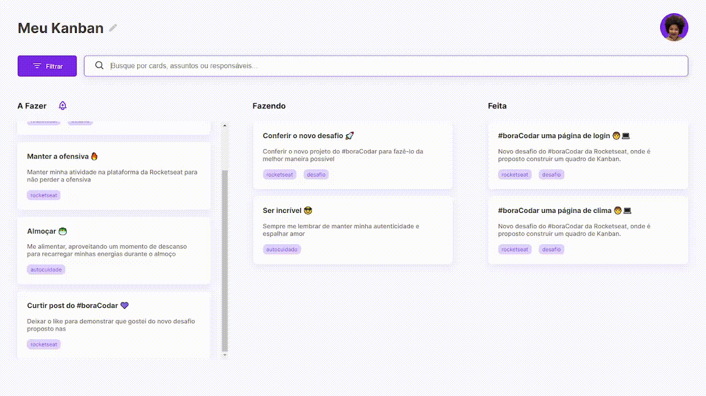
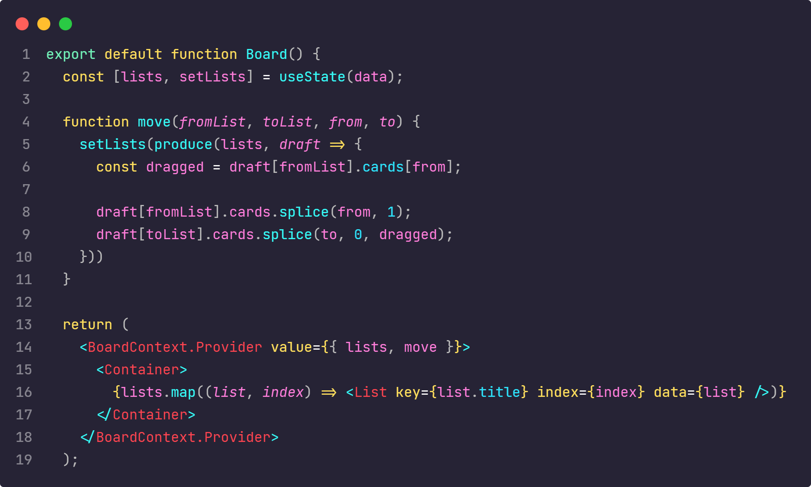
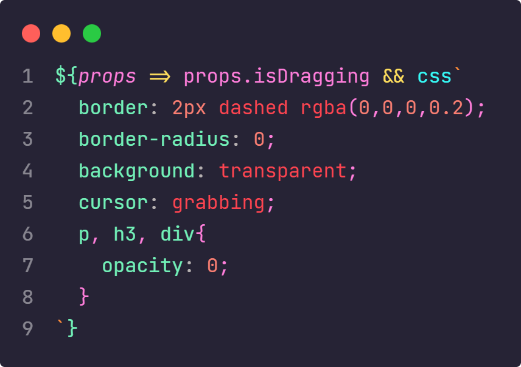

<h1 align="center">Bora Code 11</h1>

  
  
  

## Documentação
  - <a href="#projeto">Projeto</a>
  - <a href="#diario"> Diário de bordo </a>
  - <a href="#estrutura"> Estrutura do Projeto</a>
    - <a href="#stacks"> Stacks</a>
    - <a href="#stacks"> Cores</a>
    - <a href="#wakatime"> Distribuição do Tempo</a>
    - <a href="#page"> PageSpeed Insights</a>
  - <a href="#melhorias"> Melhorias</a>
  - <a href="#destaque">Destaque para alguns códigos</a>

<h2 id="projeto"> Projeto </h2>

> Bora codar 12, desenvolva um kanban, <a href="https://bora-code-12.vercel.app/" >Link para o resultado</a>

<h2 id="diario"> Diário de bordo </h2>
<table>
  <thead>
        <tr>
            <th align="center">
                 
                

                    <small>DATA</small>
                

            </th>
            <th align="center">
                 
                
 
                    <small>
                        TAREFA
                    </small>
                

            </th>
            <th align="left">
                
                
 
                    <small>
                     TEMPO
                    </small>
                

            </th>
            <th align="center">
                
                
 
                    <small>
                      COMMITS
                    </small>
                

            </th>
        </tr>
    </thead>
    <tbody>
          <tr>
            <td>24/03</td>
            <td><a href="#estrutura">Estruturação e Design</a></td>
            <td>1h 35m</td>
            <td align="center">
            <a href="#commits">1</a></td>
        </tr>
        <tr>
            <td>25/03</td>
            <td><a href="#estrutura">Drag and drop</a></td>
            <td>3h 59m</td>
            <td align="center">
            <a href="#commits">1</a></td>
        </tr>
        <tr>
            <td>26/03</td>
            <td><a href="#estrutura">Responsividade</a></td>
            <td>1h 2m</td>
            <td align="center">
            <a href="#commits">1</a></td>
        </tr>
        <tr>
            <td>28/03</td>
            <td><a href="#estrutura">Finalização +deploy</a></td>
            <td>50m</td>
            <td align="center">
            <a href="#commits">1</a></td>
        </tr>
    </tbody>
</table>

<h2 id="estrutura"> Estrutura do Projeto </h2>

<h3 id="stacks"> Stacks utilizadas </h3>
  <strong>Gsap,  <strong>
  <strong>Google Fonts,<strong>
  <strong>Figma,<strong>
  <strong>Wakatime,<strong>
  <strong>React-dnd,<strong>
  <strong>Immer,<strong>
  <strong>Pagespeed<strong>
  
<h3 id="cores">Cores do Projeto</h3>

| Cor               | Hexadecimal                                                |
| ----------------- | ---------------------------------------------------------------- |
| Purple      |  #7C3AED |
| Purple light     |  #E2D6FF |
| White     |  #FFF |
| Black     |  #403937|
| Black light     |  #756966 |
| Icon color     |  #C7C7CD |

<h3 id="wakatime">Tempo distribuido em linguagens </h3>

| # | Tempo         | linguagem                                      |
|--| ----------------- | ---------------------------------------------------------------- |
| # |  5h 46m | JavasScript (react) |
| # | 39m | css (global.jsx)|

<h3 id="page">PageSpeed Insights</h3>
Dados do computador 
 
Dados para os dispositivos movéis 

<h2 id="melhorias"> Melhorias ao Projeto</h2>

- Ligação a um banco de dados
- Requisão de imagens do banco
- Usuários
- Salvar os kanbans

<h2 id="destaque">Destaque para alguns códigos</h2>

## Licença

[MIT](./LICENSE)
